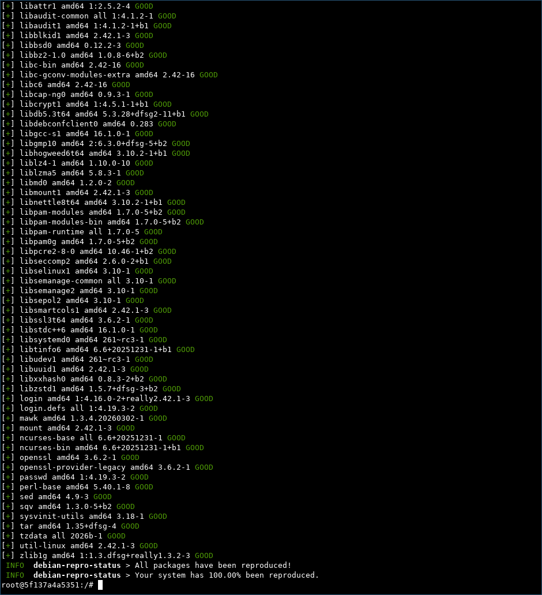

# debian-repro-status

A CLI tool for querying the [reproducibility](https://reproducible-builds.org/) status of the Debian packages using data from a [rebuilderd](https://github.com/kpcyrd/rebuilderd) instance such as [reproduce.debian.net](https://reproduce.debian.net/).

This code is heavily inspired and partially yoinked from [arch-repro-status](https://gitlab.archlinux.org/archlinux/arch-repro-status) authored by [Orhun Parmaksız](https://github.com/orhun).

## Installation

### Debian (>= trixie)

```sh
apt-get install debian-repro-status
```

### crates.io

```sh
cargo install debian-repro-status
```

## Usage

```sh
debian-repro-status
```

## Example output



## License

[The MIT License](https://opensource.org/licenses/MIT)
